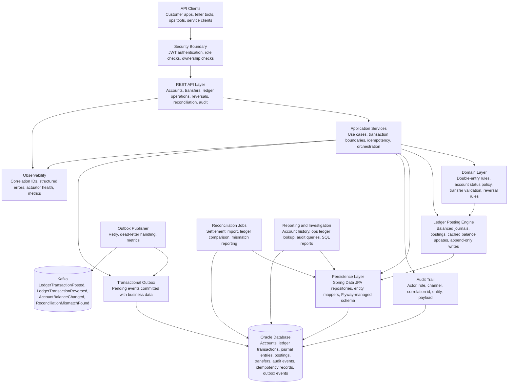

# Mini Core Banking Ledger

[](https://github.com/kavrin/BankingLedger/actions/workflows/backend-ci.yml)

A Spring Boot portfolio project for a compact banking-style ledger with double-entry accounting, ACID transaction handling, auditability, Oracle-oriented persistence, reconciliation, and event publishing.

The backend API lives in `banking-ledger-api`.

## Table Of Contents

- [Tech Stack](#tech-stack)
- [Feature Highlights](#feature-highlights)
- [Quickstart](#quickstart)
- [Project Structure](#project-structure)
- [End-State Architecture](#end-state-architecture)
- [Prerequisites](#prerequisites)
- [Environment Setup](#environment-setup)
- [Run Development Infrastructure](#run-development-infrastructure)
- [Run The API Locally](#run-the-api-locally)
- [CI And Quality Gates](#ci-and-quality-gates)
- [Developer Commands](#developer-commands)
- [Demo Flow](#demo-flow)
- [Spring Profiles](#spring-profiles)
- [Oracle Database](#oracle-database)
- [CloudBeaver Database Manager](#cloudbeaver-database-manager)
- [Kafka](#kafka)
- [Production Compose](#production-compose)
- [Build And Test](#build-and-test)
- [Database Migrations](#database-migrations)
- [Documentation](#documentation)
- [Development Notes](#development-notes)

## Tech Stack

- Java 21
- Spring Boot 3.5.x
- Spring Web
- Spring Security and OAuth2 Resource Server
- Spring Data JPA / Hibernate
- Oracle Database Free 23c
- Flyway
- Kafka
- Docker Compose
- GitHub Actions
- CloudBeaver browser database manager

## Feature Highlights

- Double-entry ledger posting with balanced journal entries and append-only financial history.
- Account, transfer, reversal, adjustment, reconciliation, audit, ledger investigation, and outbox APIs.
- ACID transaction boundaries for ledger records, cached balances, audit rows, idempotency records, and outbox events.
- Pessimistic account locking and idempotency keys to protect money movement under retries and concurrency.
- JWT bearer authentication, role authorization, account ownership checks, and structured security errors.
- Transactional outbox publishing to Kafka with retry, dead-letter handling, and protected requeue operations.
- Oracle-oriented Flyway schema, SQL reports, deterministic dev seed data, OpenAPI docs, and runnable HTTP demo flow.
- GitHub Actions quality gates for Maven verification, Oracle-backed integration checks, coverage, dependency review, secret scanning, and container scanning.

## Quickstart

Run the backend locally from a clean checkout:

```bash
cd banking-ledger-api
cp .env.example .env
make deps-up
make run
```

Then open:

```text
http://localhost:8080/swagger-ui/index.html
```

Run the guided API demo from [banking-ledger-api/http/demo-flow.http](banking-ledger-api/http/demo-flow.http), or issue sample tokens manually:

```bash
make token-customer
make token-ops
```

## Project Structure

```text
.
├── .github/
│   └── workflows/
│       └── backend-ci.yml
├── banking-ledger-api/
│   ├── compose.ci.yaml
│   ├── compose.dev.yaml
│   ├── compose.prod.yaml
│   ├── compose.yaml
│   ├── Dockerfile
│   ├── .env.example
│   ├── pom.xml
│   └── src/
└── docs/
    ├── CoreBusinessLogic.md
    ├── DatabaseDesign.md
    ├── Roadmap.md
    └── Project.md
```

## End-State Architecture

The project is designed as a modular Spring Boot core banking ledger. The API layer accepts operational requests, application services coordinate transactional workflows, domain policies enforce financial invariants, and Oracle remains the system of record for accounts, transfers, ledger postings, audit events, idempotency records, and outbox events.



Key architectural properties:

- Double-entry posting is the only normal path for balance-changing financial activity.
- Posted ledger records are append-only; corrections use reversals or adjustment entries.
- Account balances are cached views updated inside the same database transaction as postings.
- Idempotency protects write APIs from duplicate client retries.
- Audit and outbox records are committed atomically with financial workflows.
- Kafka publishing is decoupled through the transactional outbox so database commits are never dependent on broker availability.
- Oracle constraints remain a final safety net for amount, status, currency, and relationship invariants.

## Prerequisites

- JDK 21
- Docker Desktop or Docker Engine with Docker Compose
- Git

The Maven wrapper is included, so a local Maven installation is not required.

## Environment Setup

From the API folder:

```bash
cd banking-ledger-api
cp .env.example .env
```

The default development values are:

```text
DB_URL=jdbc:oracle:thin:@localhost:1521/FREEPDB1
DB_USERNAME=ledger_dev
DB_PASSWORD=ledger_dev_password
ORACLE_PASSWORD=oracle_admin_password
CLOUDBEAVER_PORT=8978
KAFKA_BOOTSTRAP_SERVERS=localhost:9092
```

Do not commit `.env`.

## Run Development Infrastructure

Start Oracle, CloudBeaver, and Kafka:

```bash
cd banking-ledger-api
docker compose -f compose.dev.yaml up -d
```

Check container status:

```bash
docker compose -f compose.dev.yaml ps
```

Open CloudBeaver:

```text
http://localhost:8978
```

Development CloudBeaver login:

```text
Username: cbadmin
Password: cbadmin_Password1
```

Create an Oracle connection in CloudBeaver with:

```text
Host: oracle
Port: 1521
Service: FREEPDB1
Username: ledger_dev
Password: ledger_dev_password
```

CloudBeaver only applies the seeded admin login during first workspace initialization. If the CloudBeaver volume was already initialized, reset it before starting again:

```bash
docker compose -f compose.dev.yaml down -v
docker compose -f compose.dev.yaml up -d
```

Stop development infrastructure:

```bash
docker compose -f compose.dev.yaml down
```

Remove development volumes if you need a clean database:

```bash
docker compose -f compose.dev.yaml down -v
```

## Run The API Locally

Start the development infrastructure first, then run:

```bash
cd banking-ledger-api
./mvnw spring-boot:run
```

The application uses the `dev` profile by default.

API base URL:

```text
http://localhost:8080
```

Actuator health endpoint:

```text
http://localhost:8080/actuator/health
```

OpenAPI documentation:

```text
http://localhost:8080/swagger-ui/index.html
http://localhost:8080/v3/api-docs
```

The local demo collection is [banking-ledger-api/http/demo-flow.http](banking-ledger-api/http/demo-flow.http).

## CI And Quality Gates

Backend CI runs through [Backend CI](.github/workflows/backend-ci.yml) on pull requests and pushes to `main`.

The workflow:

- Starts Oracle Free and Kafka with [compose.ci.yaml](banking-ledger-api/compose.ci.yaml).
- Runs Maven validation, tests, verification, and jar packaging.
- Generates JaCoCo coverage reports.
- Builds the Docker image with OCI labels.
- Runs dependency review, OWASP dependency-check, Gitleaks, and Trivy.
- Uploads test, coverage, dependency, and scan artifacts where useful.

Local CI parity commands:

```bash
cd banking-ledger-api
make ci-deps-up
./mvnw -DskipTests validate
./mvnw test
./mvnw verify
make dependency-check
make docker-build
make ci-deps-down
```

See [docs/QualityReport.md](docs/QualityReport.md) and [docs/BranchProtection.md](docs/BranchProtection.md) for coverage artifacts, known test gaps, vulnerability thresholds, and recommended required checks.

## Developer Commands

Convenience commands are available from `banking-ledger-api/`:

```bash
make deps-up
make run
make test
make token-customer
make token-ops
```

See [docs/LocalDevelopment.md](docs/LocalDevelopment.md) for the full command list, environment variables, seed data, and troubleshooting.

## Demo Flow

The fastest way to review the backend is to run the local services, start the API, then execute [banking-ledger-api/http/demo-flow.http](banking-ledger-api/http/demo-flow.http) from an IDE REST client such as IntelliJ HTTP Client or VS Code REST Client.

From `banking-ledger-api/`, start dependencies and the API:

```bash
make deps-up
make run
```

In another terminal, confirm the API is healthy and issue sample role tokens if you want to test with `curl` manually:

```bash
curl http://localhost:8080/actuator/health
make token-customer
make token-teller
make token-ops
make token-auditor
```

For the full guided flow, open `http/demo-flow.http` and run the requests from top to bottom. The file first issues dev JWTs, then demonstrates:

- Seeded account lookup.
- Account creation as a teller.
- Transfer creation with `Idempotency-Key`.
- Idempotent replay using the same request.
- Idempotency conflict using the same key with a different body.
- Transfer lookup and reversal.
- Operational adjustment posting.
- Reconciliation batch import with a mismatch.
- Reconciliation result, ledger investigation, audit, and outbox queries.

The demo uses deterministic seed data loaded by the `dev` profile, including customer `00000000-0000-0000-0000-000000000001`, account `00000000-0000-0000-0000-000000001001`, and seeded transfer `00000000-0000-0000-0000-000000005001`. If the database state becomes stale during repeated demos, reset it and start again:

```bash
make deps-reset
make deps-up
make run
```

## Spring Profiles

The default profile is `dev`.

Profile config files:

- `src/main/resources/application.yaml`
- `src/main/resources/application-dev.yaml`
- `src/main/resources/application-prod.yaml`

Run with an explicit profile:

```bash
SPRING_PROFILES_ACTIVE=dev ./mvnw spring-boot:run
```

For production:

```bash
SPRING_PROFILES_ACTIVE=prod ./mvnw spring-boot:run
```

The `prod` profile requires real environment variables for database and Kafka configuration.

## Oracle Database

Development Oracle container:

- Image: `gvenzl/oracle-free:23-slim-faststart`
- Port: `1521`
- Service name: `FREEPDB1`
- App user: `ledger_dev`
- App password: `ledger_dev_password`
- Admin password: `oracle_admin_password`

JDBC URL from the host machine:

```text
jdbc:oracle:thin:@localhost:1521/FREEPDB1
```

JDBC URL from another Docker container on the same compose network:

```text
jdbc:oracle:thin:@oracle:1521/FREEPDB1
```

## CloudBeaver Database Manager

CloudBeaver runs in the browser at:

```text
http://localhost:8978
```

Use these connection values inside CloudBeaver:

```text
Host: oracle
Port: 1521
Service name: FREEPDB1
Username: ledger_dev
Password: ledger_dev_password
```

Use `oracle` as the host because CloudBeaver runs inside Docker on the same compose network as the database.

## Kafka

Development Kafka bootstrap server from the host machine:

```text
localhost:9092
```

From another Docker container on the same compose network:

```text
kafka:9092
```

Topic auto-creation is disabled. Create topics explicitly when event publishing is implemented.

The development and production compose files include a one-shot `kafka-init` service that creates these topics:

- `banking-ledger.ledger-events`
- `banking-ledger.account-events`
- `banking-ledger.reconciliation-events`

## Production Compose

The production compose file builds and runs the API container with Oracle and Kafka.

Create an environment file first:

```bash
cd banking-ledger-api
cp .env.example .env
```

Edit `.env` and replace development passwords before running production services.

Start production services:

```bash
docker compose -f compose.prod.yaml up -d --build
```

Start production services with CloudBeaver enabled:

```bash
docker compose -f compose.prod.yaml --profile tools up -d --build
```

Stop production services:

```bash
docker compose -f compose.prod.yaml down
```

## Build And Test

Validate the Maven project:

```bash
cd banking-ledger-api
./mvnw -DskipTests validate
```

Run tests:

```bash
./mvnw test
```

Build the application:

```bash
./mvnw clean package
```

Build the production Docker image through compose:

```bash
docker compose -f compose.prod.yaml build api
```

## Database Migrations

Flyway is enabled and looks for migrations in:

```text
banking-ledger-api/src/main/resources/db/migration
```

Use names like:

```text
V1__create_core_ledger_tables.sql
V2__create_idempotency_and_outbox_tables.sql
```

Keep migrations Oracle-compatible because the project is designed around Oracle and PL/SQL-style reporting.

See `docs/CoreBusinessLogic.md` for the business and accounting flow, and `docs/DatabaseDesign.md` for schema rationale, transaction isolation choices, locking strategy, and database best practices.

## Documentation

- [API contracts and examples](docs/API.md)
- [Local development guide](docs/LocalDevelopment.md)
- [Portfolio narrative](docs/Portfolio.md)
- [Incident write-ups](docs/Incidents.md)
- [Quality report](docs/QualityReport.md)
- [Branch protection](docs/BranchProtection.md)
- [Backend roadmap](docs/Roadmap.md)
- [Feature matrix](docs/FeatureMatrix.md)
- [Known limitations](docs/KnownLimitations.md)
- [Glossary](docs/Glossary.md)
- [Reports](reports/README.md)
- [Architecture diagram](docs/diagrams/architecture.mmd)
- [Transfer flow diagram](docs/diagrams/transfer-flow.mmd)
- [Reversal flow diagram](docs/diagrams/reversal-flow.mmd)
- [Outbox publishing diagram](docs/diagrams/outbox-publishing.mmd)
- [Transaction boundaries diagram](docs/diagrams/transaction-boundaries.mmd)
- [ERD](docs/diagrams/erd.mmd)

Key ADRs:

- [Double-entry, amounts, and idempotency](docs/ADR-DoubleEntryAmountIdempotency.md)
- [Transaction isolation and account locking](docs/ADR-Phase5-TransactionIsolationAndLocking.md)
- [Immutable reversals and adjustments](docs/ADR-Phase6-ImmutableLedgerReversalsAndAdjustments.md)
- [JWT authentication and authorization](docs/ADR-Phase7-JWTAuthenticationAndAuthorization.md)
- [Audit trail and investigation APIs](docs/ADR-Phase8-AuditTrailAndInvestigationApis.md)
- [Outbox and Kafka publishing](docs/ADR-Phase9-OutboxKafkaPublishing.md)
- [Reconciliation design](docs/ADR-Phase10-Reconciliation.md)
- [Developer experience](docs/ADR-Phase12-DeveloperExperience.md)

## Development Notes

- Keep posted ledger records immutable.
- Use reversals or adjustment entries instead of destructive updates.
- Keep DTOs separate from JPA entities.
- Use explicit transaction boundaries around posting, reversal, and transfer flows.
- Store monetary amounts as integer minor units with explicit currency codes.
- Do not log sensitive data.
- Add integration tests for database constraints, rollback behavior, idempotency, and concurrent transfers.
