# Core Business Logic

This document explains the business and accounting logic behind the Mini Core Banking Ledger. It is written for a technical reader who does not need to be a banking expert.

The short version: this project models money movement as immutable accounting records. Account balances are useful cached views, but the ledger postings are the source of truth.

## System Map

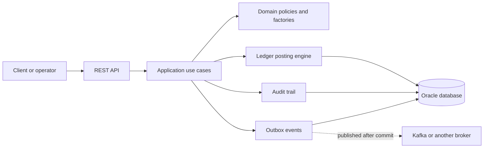

The application is organized around business capabilities:

| Area | Purpose | Current state |
| --- | --- | --- |
| Customers | Own customer-facing accounts. | Schema and persistence model exist. |
| Accounts | Store account identity, status, currency, type, and cached balances. | Account creation, lookup, balance, and transaction history are implemented. |
| Ledger | Records financial facts through transactions, journal entries, and postings. | Double-entry posting engine is implemented. |
| Transfers | Represents account-to-account movement workflow. | Schema, DTOs, command/query objects, and repository exist; full use case is planned. |
| Audit | Records who did important operations and how to trace them. | Account creation and ledger posting write audit events. |
| Idempotency | Prevents duplicate money movement on client retries. | Schema exists; transfer integration is planned. |
| Outbox | Publishes financial events reliably after database commit. | Ledger posting writes pending outbox events; publisher is planned. |
| Reconciliation | Compares internal ledger records with external settlement records. | Package and roadmap exist; implementation is planned. |

## Core Domain Language

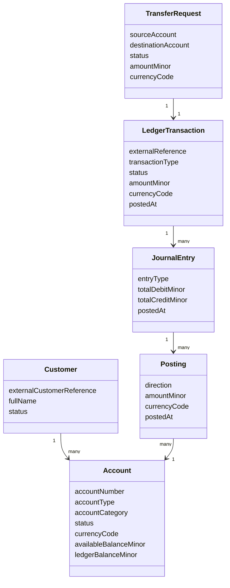

Important terms:

- `Account` is the business account. It can be customer-facing, like `CURRENT`, `SAVINGS`, or `WALLET`, or internal, like `SUSPENSE`, `CLEARING`, or `FEE_INCOME`.
- `LedgerTransaction` is the business-level financial event, such as a transfer, fee, reversal, or adjustment.
- `JournalEntry` groups the accounting lines for one ledger transaction.
- `Posting` is one debit or credit line against one account.
- `TransferRequest` is workflow state for a transfer. It is not the accounting source of truth.
- `AuditEvent` records operational traceability.
- `OutboxEvent` is a reliable message waiting to be published after the database transaction commits.

## Ledger Transaction, Journal Entry, And Posting

These three objects are different levels of the same accounting event:

```text
LedgerTransaction
└── JournalEntry
    ├── Posting
    └── Posting
```

| Object | Main question it answers | Example |
| --- | --- | --- |
| `LedgerTransaction` | What financial business event happened? | Transfer USD 100.00. |
| `JournalEntry` | How is that event recorded as a balanced accounting entry? | Debit total `10000`, credit total `10000`. |
| `Posting` | Which account is affected, in which direction, and by how much? | Debit Account A by `10000`; credit Account B by `10000`. |

`LedgerTransaction` stores the business-level context: transaction type, amount, currency, status, optional external reference, description, and posted time. It is the record a support or operations person usually searches for when investigating a payment.

`JournalEntry` is the accounting container for the transaction. It groups the debit and credit lines and stores the declared debit and credit totals. The important invariant is that the journal entry must balance.

`Posting` is the individual account-level movement. Each posting points to exactly one account and says whether that account is debited or credited for a positive amount in one currency. Cached balances are updated from postings, not directly from the higher-level transaction.

For a simple transfer:

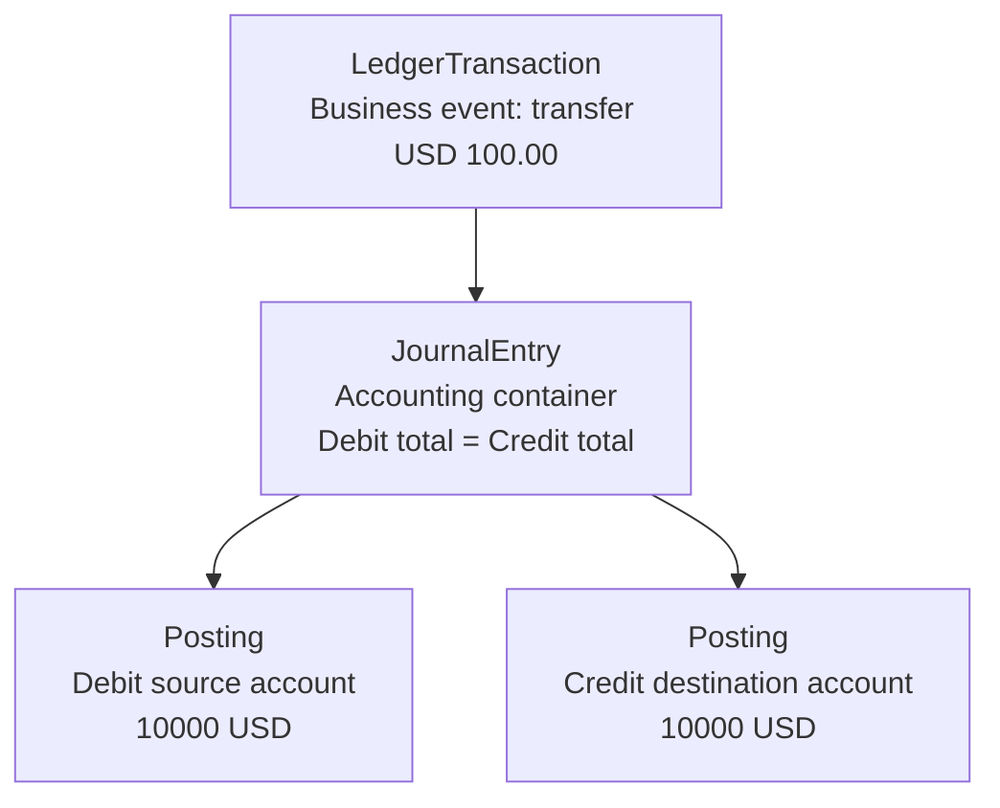

### External Reference

`externalReference` is an optional caller-provided business reference for a ledger transaction. It is useful when another system, client, or workflow already has its own identifier for the same operation.

Examples:

- Mobile transfer request id: `MOB-TRX-2026-000123`.
- Payment gateway reference: `PAY-998877`.
- Internal workflow reference: `transfer-abc-123`.

The project stores this value in `ledger_transactions.external_reference`. When a non-blank external reference is provided, `PostLedgerTransactionUseCase` checks whether a ledger transaction with that reference already exists. If it does, the use case rejects the request with a conflict instead of posting the same financial event twice.

`externalReference` is different from the database `id`:

| Field | Source | Purpose |
| --- | --- | --- |
| `id` | Generated by this system. | Internal primary key and table relationship identifier. |
| `externalReference` | Provided by a caller or upstream workflow. | Business lookup key and duplicate-posting guard. |

## Money Representation

Money is stored as integer minor units:

| Human amount | Currency | Stored value |
| --- | --- | --- |
| USD 10.00 | `USD` | `1000` |
| USD 0.99 | `USD` | `99` |
| EUR 125.50 | `EUR` | `12550` |

The project intentionally avoids floating-point money values. Database amount columns use `number(19, 0)`, and Java business logic uses `long amountMinor`.

Each financial row also stores an explicit `currencyCode`. The database and domain layer reject mixed-currency journal entries and postings that do not match the account currency.

## Double-Entry Accounting

Every posted financial transaction must balance:

```text
sum(DEBIT postings) == sum(CREDIT postings)
```

In this project, a simple transfer of USD 100.00 from Account A to Account B is represented as:

| Account | Direction | Amount minor | Meaning in this project |
| --- | --- | ---: | --- |
| Account A | `DEBIT` | `10000` | Reduce the source customer balance. |
| Account B | `CREDIT` | `10000` | Increase the destination customer balance. |

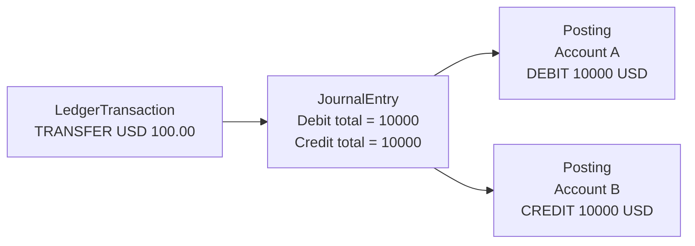

The accounting rule is enforced before persistence by `DoubleEntryPostingPolicy`:

- There must be at least two postings.
- There must be at least one debit and one credit.
- Every posting amount must be positive.
- Every posting currency must match the transaction currency.
- Total debits must equal total credits.
- The debit total must equal the transaction amount.

The database adds another safety net through check constraints and composite foreign keys.

## Ledger Posting Flow

The implemented ledger posting use case follows this sequence:

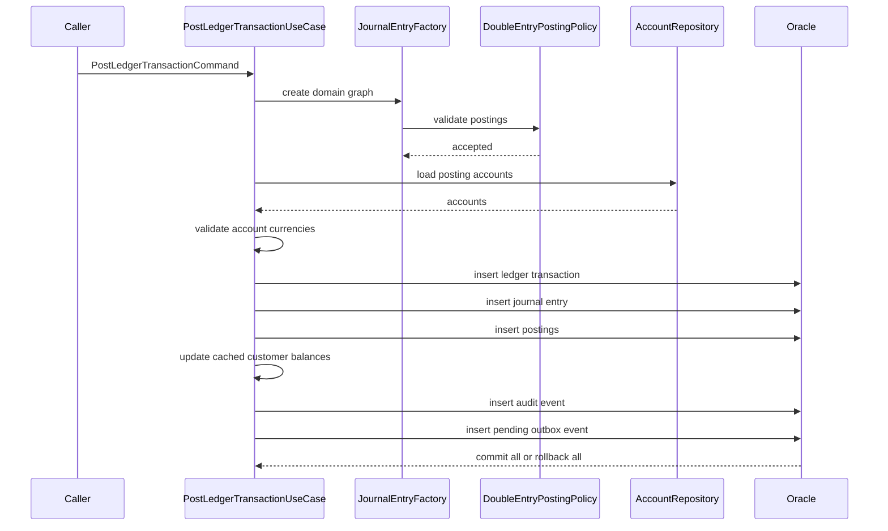

The public handler is transactional. If any later step fails, the ledger transaction, journal entry, postings, balance changes, audit event, and outbox event roll back together.

## Account Balance Logic

The project keeps two balance concepts on an account:

| Balance | Meaning |
| --- | --- |
| `ledgerBalanceMinor` | The posted balance according to committed ledger activity. |
| `availableBalanceMinor` | The amount available for new spending or transfers. |

In the current implementation, both balances move together because holds, reservations, and pending authorization flows are not implemented yet.

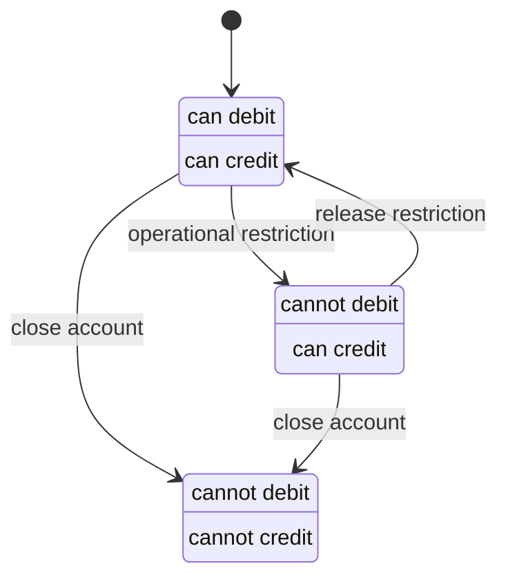

`AccountStatusPolicy` controls whether an account can be debited or credited:

| Status | Debit allowed | Credit allowed |
| --- | --- | --- |
| `ACTIVE` | Yes | Yes |
| `FROZEN` | No | Yes |
| `CLOSED` | No | No |

`AccountBalanceUpdater` applies postings only to customer accounts. Internal accounts are present in the model and schema, but cached balance updates for internal account types are deferred to later phases.

## Customer Account Creation

Customer account creation is implemented as a normal business workflow:

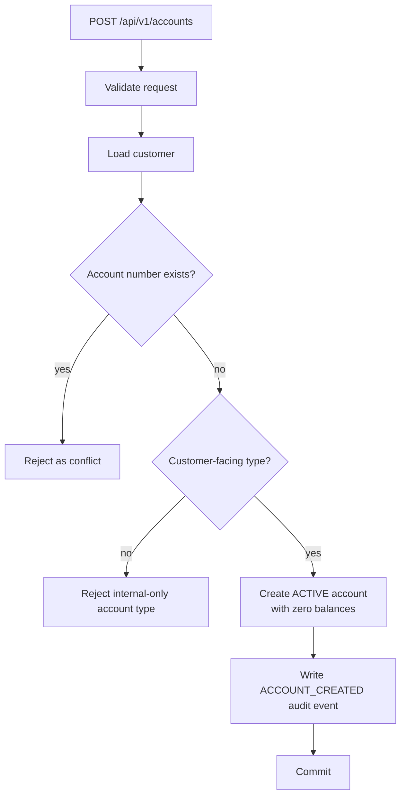

Rules:

- Account number is required, unique, and limited to 34 characters.
- Currency is normalized and validated as a three-letter uppercase code.
- Customer-created accounts cannot use internal-only account types like `SUSPENSE`, `CLEARING`, or `FEE_INCOME`.
- New accounts start as `ACTIVE`.
- New account balances start at zero.
- Account creation writes an audit event in the same transaction.

## Transfer Business Flow

The transfer table and DTOs already exist, and the roadmap defines the full intended behavior. A completed transfer should use the ledger posting engine instead of directly editing balances.

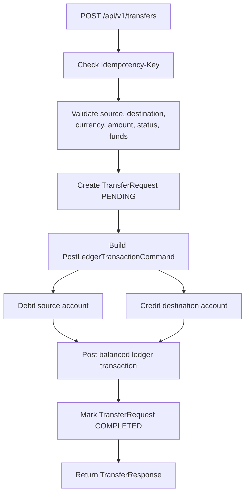

The intended accounting entry for an internal transfer is:

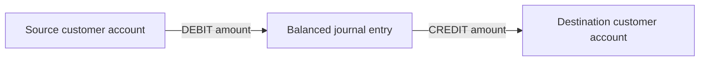

The transfer request is workflow state:

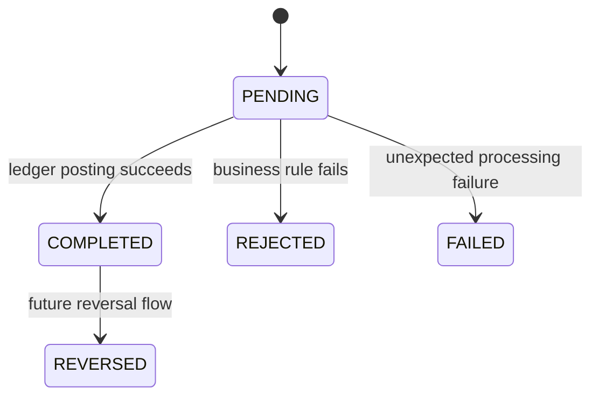

Expected transfer rules:

- Source and destination accounts must be different.
- Amount must be positive.
- Source and destination currencies must match the transfer currency.
- Source account must be debit-allowed.
- Destination account must be credit-allowed.
- Source account must have enough available balance.
- A duplicate external reference must not create another transfer.
- A duplicate idempotency key with the same request should replay the original response.
- A duplicate idempotency key with a different request should be rejected.

## Idempotency

Idempotency protects money movement from duplicate client retries. For example, a mobile app might timeout after sending a transfer request, then retry with the same idempotency key.

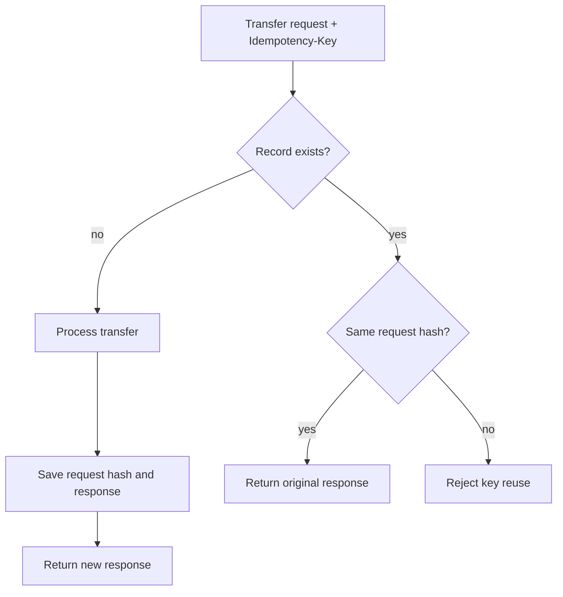

The schema supports idempotency with:

- `operation_scope`, such as `TRANSFER_CREATE`.
- `idempotency_key`, supplied by the client.
- `request_hash`, computed from the normalized request.
- `response_status` and `response_body`, used for replay.
- `resource_type` and `resource_id`, used to connect the idempotency record to the created business object.

## Audit And Traceability

Audit events answer operational questions:

- What happened?
- Which entity was affected?
- Who or what initiated it?
- Which role or actor type was involved?
- Which API call or workflow can be traced through the correlation ID?

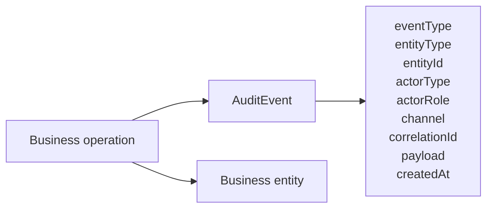

Current implemented audit events include:

| Event | Entity type | When written |
| --- | --- | --- |
| `ACCOUNT_CREATED` | `ACCOUNT` | After account creation. |
| `LEDGER_TRANSACTION_POSTED` | `LEDGER_TRANSACTION` | After successful ledger posting. |

Audit rows are written inside the same database transaction as the business change.

## Outbox Event Publishing

Financial systems usually cannot rely on publishing a message and committing the database in two unrelated operations. If the database commit succeeds but publishing fails, downstream systems miss an event. If publishing succeeds but the database rolls back, downstream systems see an event for something that did not happen.

This project uses the outbox pattern:

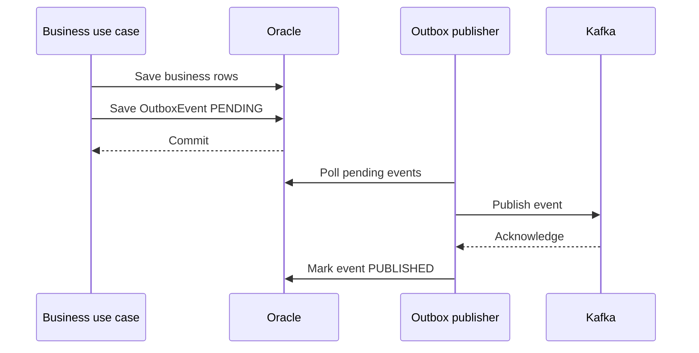

Current ledger posting writes a `LedgerTransactionPosted` event with status `PENDING`. The future publisher can retry failed publishes and eventually move unrecoverable events to `DEAD_LETTER`.

## Database Guardrails

The database is treated as a final safety net. Important invariants are protected at the schema level:

| Invariant | Database mechanism |
| --- | --- |
| Unique account numbers | Unique constraint on `accounts.account_number`. |
| Valid account statuses and types | Check constraints. |
| Positive financial amounts | Check constraints on amount columns. |
| Debit or credit only | Check constraint on `postings.direction`. |
| Journal balances | Check constraint that debit total equals credit total. |
| Currency consistency | Composite foreign keys across account, transaction, journal, and posting currency. |
| Duplicate ledger external references | Unique constraint on `ledger_transactions.external_reference`. |
| One transfer per ledger transaction | Unique constraint on `transfer_requests.ledger_transaction_id`. |
| Idempotency key uniqueness | Unique constraint on `(operation_scope, idempotency_key)`. |
| Outbox lifecycle correctness | Check constraints on publish and retry timestamps. |

Application validation gives clear business errors. Database constraints make invalid states hard to persist even if application code has a bug.

## Reversals And Adjustments

Posted ledger records should not be edited or deleted in normal workflows. Corrections should be new financial entries.

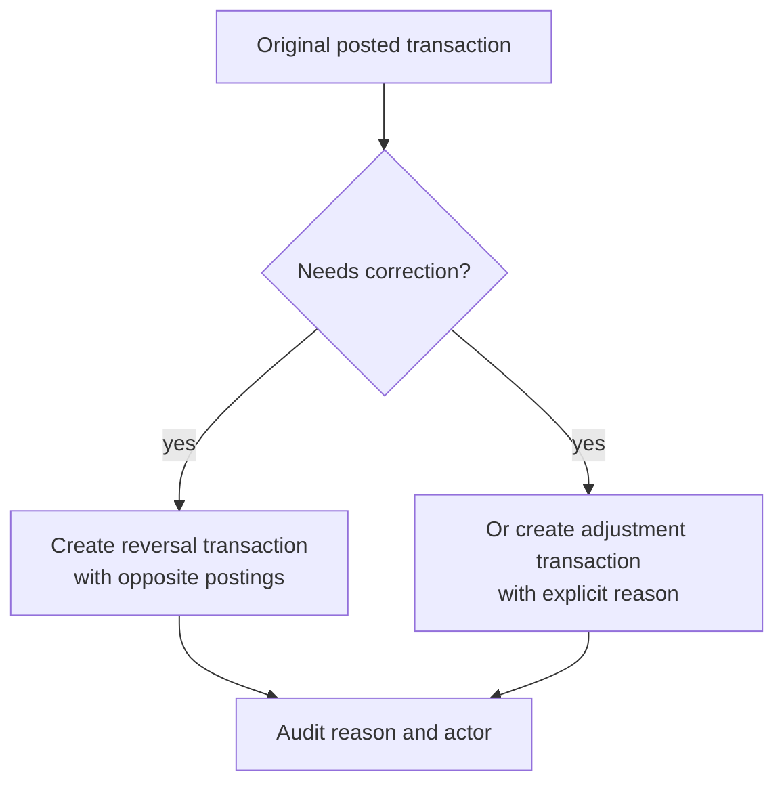

Planned behavior:

- A reversal creates equal and opposite postings.
- The original transaction remains visible.
- The reversal links back to the original transaction.
- Duplicate reversals are rejected.
- Operational adjustments require an explicit reason and audit event.

This is safer than changing historical rows because investigators can see the full chain of events.

## Reconciliation

Reconciliation compares internal ledger records with an external source, such as a settlement file or payment network report.

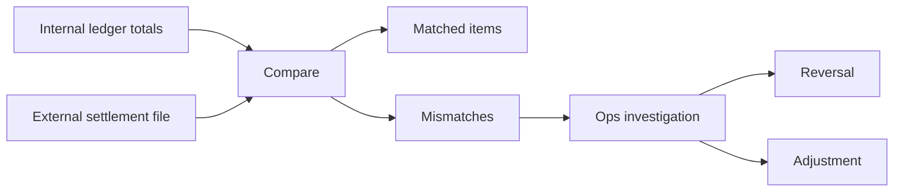

The reconciliation package is present as a future capability. The intended use is to detect questions like:

- Did the external settlement file include a payment that is missing internally?
- Did the ledger post a transaction that never settled externally?
- Does an amount or currency differ between systems?
- Are suspense or clearing accounts carrying old unresolved balances?

## End-To-End Example

Here is the intended business flow for a USD 25.00 transfer from Alice to Bob:

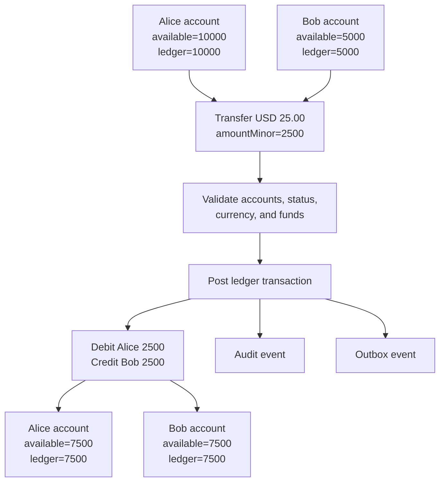

Accounting view:

| Step | Account | Direction | Amount minor | Cached balance effect |
| --- | --- | --- | ---: | --- |
| Before | Alice | - | - | `10000` |
| Before | Bob | - | - | `5000` |
| Posting | Alice | `DEBIT` | `2500` | Alice becomes `7500`. |
| Posting | Bob | `CREDIT` | `2500` | Bob becomes `7500`. |

The journal balances because total debits are `2500` and total credits are `2500`.

## What To Read Next

- `docs/backend/Project.md` for the project goals, scope, user stories, and end-state requirements.
- `docs/backend/DatabaseDesign.md` for schema details, constraints, indexes, and transaction isolation notes.
- `docs/operations/Roadmap.md` for completed and planned implementation phases.
- `banking-ledger-api/src/main/java/dev/kavrin/banking_ledger/ledger/domain/policy/DoubleEntryPostingPolicy.java` for the core double-entry validation rules.
- `banking-ledger-api/src/main/java/dev/kavrin/banking_ledger/ledger/application/service/PostLedgerTransactionUseCase.java` for the implemented posting workflow.
- `banking-ledger-api/src/main/java/dev/kavrin/banking_ledger/ledger/application/service/AccountBalanceUpdater.java` for cached balance updates.
