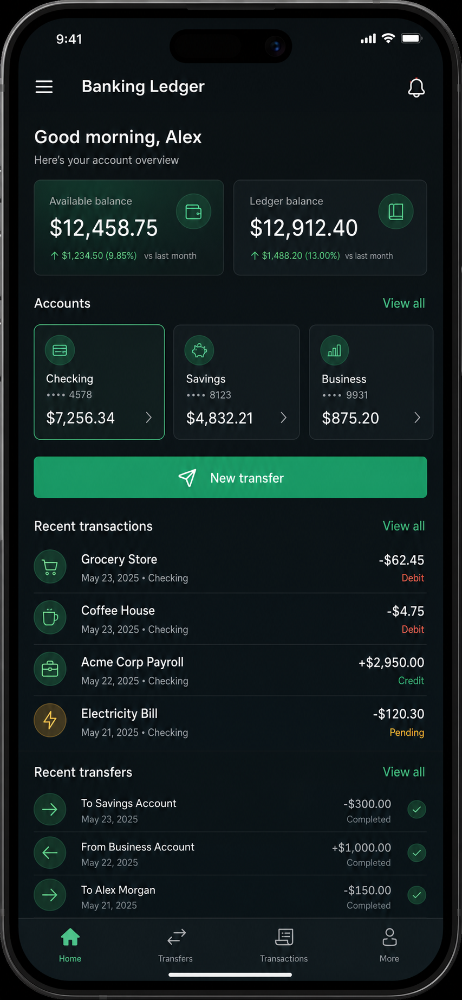
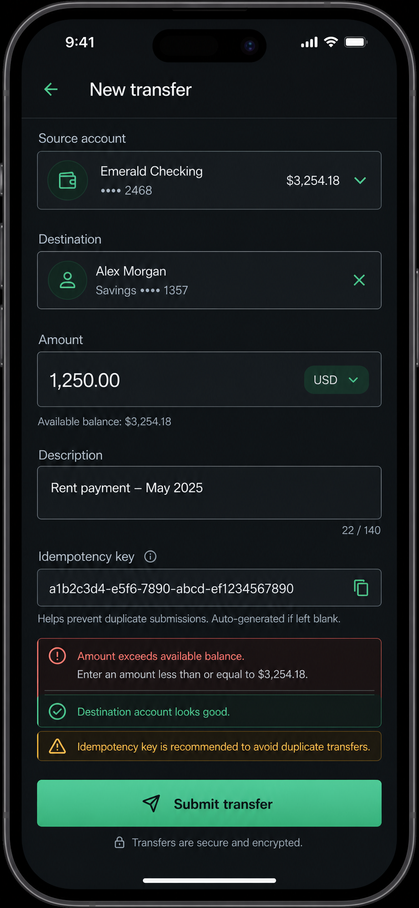
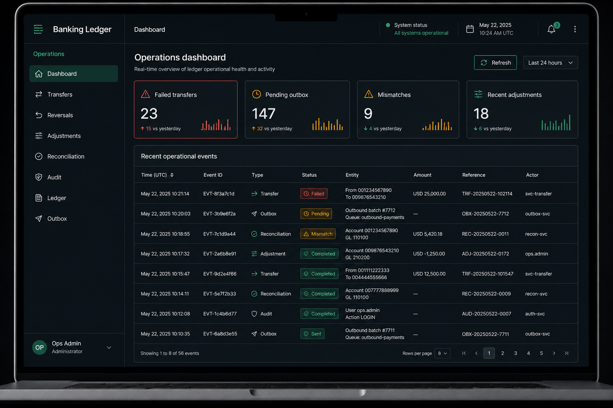

# Banking Ledger Design System

This document defines the first visual language for the Banking Ledger Compose Multiplatform client. It is based only on the approved dark mockups below and should guide the initial `core/designsystem` implementation.

The direction is dark-first, premium fintech, ink/emerald, and demo-ready. Customer mobile screens should feel calm and direct. Desktop admin screens should be dense, operational, and optimized for scanning financial events.

## Approved References

## Design Direction

- Use real workflow screens as the first experience; do not create marketing or landing-page surfaces.
- Prefer dark ink surfaces with emerald emphasis, subtle outlines, and high-contrast typography.
- Keep the product credible for a banking ledger demo without introducing fake consumer-bank branding.
- Mobile customer flows prioritize clarity, confidence, and obvious primary actions.
- Desktop admin flows prioritize dense tables, status scanning, and operational health.
- Use status colors consistently: green for healthy/completed, amber for pending/mismatch, red for failed/error.

## Color Tokens

These tokens are approximate values extracted from the approved mockups. They are implementation starting points and can be refined during Compose theme work.

| Token | Value | Use |
|---|---:|---|
| `background.app` | `#050B0D` | Main dark app background |
| `background.panel` | `#081010` | Desktop sidebar, mobile root |
| `surface.default` | `#101818` | Cards, fields, table containers |
| `surface.raised` | `#101F1D` | Emphasized cards and selected containers |
| `surface.selected` | `#0E3A2B` | Active nav item, selected account card |
| `border.subtle` | `#243235` | Dividers and table row borders |
| `border.strong` | `#3A4A4D` | Text fields and card outlines |
| `text.primary` | `#F4F7F5` | Primary text |
| `text.secondary` | `#B5C0BE` | Labels, metadata |
| `text.muted` | `#7F8D8A` | Helper text, inactive nav |
| `primary` | `#48C090` | CTA fill, positive action |
| `primary.strong` | `#189860` | Active icons and selected borders |
| `primary.container` | `#103828` | Emerald icon/avatar background |
| `success` | `#48C090` | Completed, credit, healthy |
| `warning` | `#F0B429` | Pending, mismatch, caution |
| `error` | `#FF6B63` | Failed, validation error |
| `info` | `#8AA4FF` | Informational states, optional |

### Compose Material 3 Mapping

Map the design tokens into Material 3 semantic roles where possible:

| Design token | Material 3 role |
|---|---|
| `background.app` | `background` |
| `background.panel` | `surface` |
| `surface.default` | `surfaceContainer` |
| `surface.raised` | `surfaceContainerHigh` |
| `surface.selected` | `primaryContainer` or component-local selected color |
| `text.primary` | `onBackground`, `onSurface` |
| `text.secondary` | `onSurfaceVariant` |
| `primary` | `primary` |
| `text.primary` on primary fills | `onPrimary` |
| `error` | `error` |
| `border.strong` | `outline` |
| `border.subtle` | `outlineVariant` |

## Typography Tokens

Use Poppins as the Banking Ledger product font and map it into Compose Material 3 typography. Bundle the font in shared Compose resources so Android, iOS, and desktop render consistently.

| Token | Size | Weight | Use |
|---|---:|---:|---|
| `type.mobile.screenTitle` | `28-32sp` | Semibold | Mobile page titles such as `New transfer` |
| `type.mobile.sectionTitle` | `22-24sp` | Semibold | Mobile sections such as `Accounts` and `Recent transactions` |
| `type.mobile.body` | `16sp` | Regular | Mobile row content and field values |
| `type.mobile.label` | `14-16sp` | Medium | Field labels, nav labels, helper text |
| `type.desktop.pageTitle` | `22-24sp` | Semibold | Desktop page titles such as `Operations dashboard` |
| `type.desktop.body` | `13-14sp` | Regular | Desktop table rows and metadata |
| `type.metric.number` | `32-40sp` | Semibold | Balances and operational counts |
| `type.badge.label` | `12-13sp` | Medium | Status badges and compact chips |

Rules:

- Keep financial numbers visually prominent and easy to scan.
- Use muted labels above high-value content rather than decorative captions.
- Avoid negative letter spacing; keep text readable at mobile and desktop densities.
- Desktop tables should favor compact body text with strong row alignment.

## Spacing, Radius, And Border Tokens

| Token | Value | Use |
|---|---:|---|
| `space.grid` | `4dp` | Base spacing unit |
| `space.mobile.screenX` | `24dp` | Mobile horizontal screen padding |
| `space.desktop.content` | `24dp` | Desktop content padding |
| `space.component.sm` | `12dp` | Compact internal padding |
| `space.component.md` | `16dp` | Default internal padding |
| `space.component.lg` | `24dp` | Large content groups |
| `size.mobile.row` | `64-76dp` | Mobile list and transfer rows |
| `size.desktop.row` | `48-56dp` | Desktop table rows |
| `radius.card` | `12dp` | Cards and table containers |
| `radius.field` | `10-12dp` | Text fields and selectors |
| `radius.button` | `14-16dp` | Primary CTAs and toolbar actions |
| `radius.badge` | `full` | Badges, chips, nav pills |
| `radius.iconContainer` | `full` | Circular icon containers |
| `border.width.default` | `1dp` | Fields, cards, dividers |
| `border.width.selected` | `1-2dp` | Selected account card and active states |

Depth should come from tonal surfaces and borders, not heavy shadows.

## Status Badge Tokens

| Status | Text color | Container | Border | Use |
|---|---:|---:|---:|---|
| `completed` | `#48C090` | `#103828` | `#189860` | Successful transfer, reconciliation, audit event |
| `sent` | `#48C090` | `#103828` | `#189860` | Outbox sent state |
| `pending` | `#F0B429` | `#33280A` | `#A97900` | Pending outbox or transfer |
| `mismatch` | `#F0B429` | `#33280A` | `#A97900` | Reconciliation mismatch |
| `failed` | `#FF6B63` | `#321514` | `#A83A35` | Failed transfer or validation failure |
| `error` | `#FF6B63` | `#321514` | `#A83A35` | Form and request errors |
| `info` | `#8AA4FF` | `#111B3D` | `#405BB8` | Optional informational state |

Badges should be compact, pill-shaped, and readable in dense tables. Include a leading icon only when it improves scanning.

## Component Inventory

The design system starts with components visible in the approved mockups. Components should be built in shared Compose code only when they encode reusable Banking Ledger behavior, state, or styling. One-off screen layout can stay in feature modules.

### Mobile Components

| Component | Purpose | Variants | Key rules |
|---|---|---|---|
| `LedgerMobileTopBar` | Mobile page header with navigation and one trailing action. | Menu, back, notification. | Transparent or panel-toned background, `24dp` horizontal padding, title uses `type.mobile.screenTitle` or compact title style. |
| `BalanceSummaryCard` | Shows available and ledger balances. | Available, ledger. | Use `surface.default`, `radius.card`, large metric number, muted trend text, circular emerald icon container. |
| `AccountCard` | Shows customer account summary. | Default, selected. | Mask account identifiers, selected state uses `surface.selected` and `primary.strong` border. |
| `MobilePrimaryActionButton` | Main customer action such as new transfer or submit transfer. | Enabled, disabled, loading. | Full width, emerald fill, `radius.button`, high-contrast label and optional leading icon. |
| `LedgerOutlinedField` | Form text input shell. | Text, amount, description, read-only. | `surface.default`, `border.strong`, `radius.field`, visible label outside or above field. |
| `LedgerSelectField` | Selectable field for account, destination, currency, or filter. | Account selector, currency chip, dropdown. | Same border behavior as text field, trailing chevron or clear icon, no placeholder-only labels. |
| `ValidationPanel` | Inline validation and helper feedback. | Error, warning, success. | Use status token table, icon-leading layout, stack above primary action. |
| `CustomerBottomNavigation` | Customer mobile primary navigation. | Home, transfers, transactions, more. | Icon-first, label below icon, selected state uses `primary`, stable across customer flows. |
| `IconContainer` | Circular semantic icon background. | Primary, success, warning, muted. | Circular shape, `primary.container` default, icon color matches semantic state. |
| `FinancialListRow` | Transactions and transfers in mobile lists. | Transaction, transfer, account movement. | Leading icon/avatar, title/subtitle, trailing amount/status, `size.mobile.row`. |

### Desktop Components

| Component | Purpose | Variants | Key rules |
|---|---|---|---|
| `AdminSidebar` | Persistent desktop navigation. | Expanded, collapsed later. | `background.panel`, fixed width, selected row uses `surface.selected`, user area anchored bottom. |
| `AdminSidebarItem` | Navigation item inside sidebar. | Default, selected, disabled. | Icon plus label, `radius.badge`, selected text/icon uses `primary`. |
| `AdminTopStatusBar` | Desktop header with health and session controls. | System healthy, warning, error. | Right-aligned status cluster, subtle bottom divider, no heavy app-bar elevation. |
| `MetricCard` | Operational summary card. | Failed, pending, mismatch, completed. | `surface.default`, status-colored icon/count/trend, optional compact sparkline, `radius.card`. |
| `FilterToolbar` | Dense desktop filtering controls. | Date range, status, event type, search, refresh. | Compact controls, `size.desktop.row` alignment, no full-screen filter surface on desktop. |
| `LedgerDataTable` | Dense operational table. | Audit, outbox, transfer, reconciliation. | Header row, row dividers, compact body type, pagination footer, table owns main surface. |
| `LedgerTableColumnHeader` | Sortable table header. | Static, sortable ascending, sortable descending. | Muted text, optional sort icon, consistent alignment by column type. |
| `LedgerTableRow` | Standard desktop row. | Default, selected, warning/error emphasis. | `48-56dp` height, subtle divider, row action affordance at end. |
| `StatusBadge` | Compact state marker. | Completed, sent, pending, mismatch, failed, error, info. | Pill shape, values from status token table, optional leading icon. |
| `DesktopPagination` | Table paging controls. | Previous/next, numeric page, rows per page. | Compact controls aligned to table footer. |
| `OverflowActionButton` | Secondary actions in rows and toolbars. | Icon-only, icon plus label. | Use outline or text style; reserve filled buttons for primary actions. |
| `UserAccountSummary` | Bottom sidebar user/environment summary. | Ops admin, auditor, customer later. | Avatar initials, role label, environment indicator, dropdown affordance. |

Desktop content should be dense but not cramped. Tables own the main surface; cards summarize, then hand off to tables.

### Shared Supporting Components

| Component | Purpose | Key rules |
|---|---|---|
| `LedgerIconButton` | Reusable icon action. | Minimum touch target on mobile, compact target on desktop, semantic content description required. |
| `LedgerBadge` | Generic pill label. | Use only for compact metadata; use `StatusBadge` for workflow state. |
| `LedgerDivider` | Divider between rows and shell regions. | Use `border.subtle`; avoid visible dividers when spacing already communicates grouping. |
| `AmountText` | Financial amount display. | Align decimals in tables where practical; positive values can use `success`, negative values use primary text unless error. |
| `MaskedIdentifierText` | Account and reference identifiers. | Preserve last 4 characters for account-like IDs; do not imply real PII. |
| `EmptyState` | No data state. | Compact message plus optional action; no large illustration in operational screens. |
| `ErrorState` | Recoverable screen or panel error. | Show supportable message and correlation ID when available. |

## Mobile Layout Rules

- Use a single-column layout with `24dp` horizontal padding.
- Put the primary workflow action close to the related content and make it full width.
- Keep form labels visible; do not rely on placeholder-only inputs.
- Keep validation and helper states close to the affected form area.
- Prefer compact rows and cards over large marketing-style panels.
- Use icon containers to help scanning, but keep icons semantic and minimal.
- Bottom navigation should remain stable across customer dashboard and transfer workflows.

## Desktop Layout Rules

- Use a persistent sidebar for admin navigation.
- Keep operational status visible in the top bar.
- Place high-priority summary metrics above dense tables.
- Tables should support compact row height, clear badge states, pagination, and action affordances.
- Avoid dominant decorative charts; sparklines can support metric cards but should not become the main content.
- Use split panes later for investigation views where detail inspection is part of the workflow.
- Keep admin content scannable for repeated operational use.

## Compose Implementation Mapping

Implement this system in `banking-ledger-compose/shared/src/commonMain/kotlin/dev/kavrin/banking_ledger/core/designsystem`.

Recommended first implementation units:

- `BankingLedgerTheme` wrapping Material 3 `MaterialTheme`.
- `BankingLedgerColors` or equivalent token object for semantic colors not covered by `ColorScheme`.
- `BankingLedgerSpacing` for spacing and row-height constants.
- `BankingLedgerShapes` or Material 3 `Shapes` setup for cards, fields, buttons, and pills.
- Status badge model and composable using the badge token table.
- Mobile and desktop preview surfaces that apply the dark theme consistently.

Material 3 should remain the base component model. Custom wrappers should exist only when they encode project-specific banking ledger behavior or visual rules.

## Acceptance Checklist

- The approved mockups are the only visual references used in this document.
- Tokens are dark-first and implementation-ready for Compose.
- Customer mobile and desktop admin rules are both represented.
- Status colors cover transfer, reconciliation, outbox, audit, and form validation states.
- The document does not introduce production banking claims, real PII, or unsupported crypto/investment visuals.
